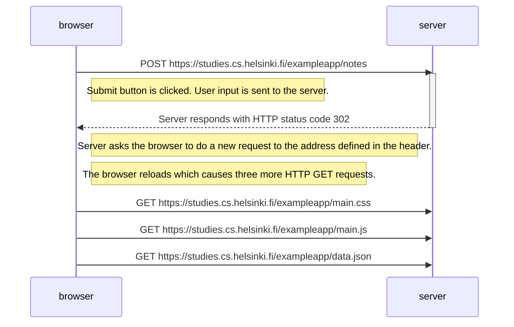

```mermaid
sequenceDiagram
    participant browser
    participant server

    browser->>server: POST https://studies.cs.helsinki.fi/exampleapp/notes
    activate server
    Note right of browser: Submit button is clicked. User input is sent to the server.
    server-->>browser: Server responds with HTTP status code 302
    deactivate server
    
    Note right of browser: Server asks the browser to do a new request to the address defined in the header.
    Note right of browser: The browser reloads which causes three more HTTP GET requests.
    
    browser->>server: GET https://studies.cs.helsinki.fi/exampleapp/main.css
    browser->>server: GET https://studies.cs.helsinki.fi/exampleapp/main.js
    browser->>server: GET https://studies.cs.helsinki.fi/exampleapp/data.json
```